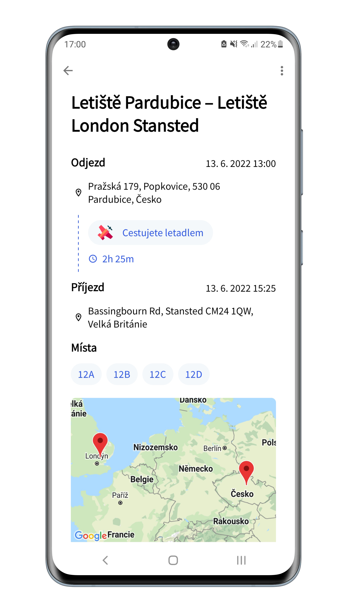
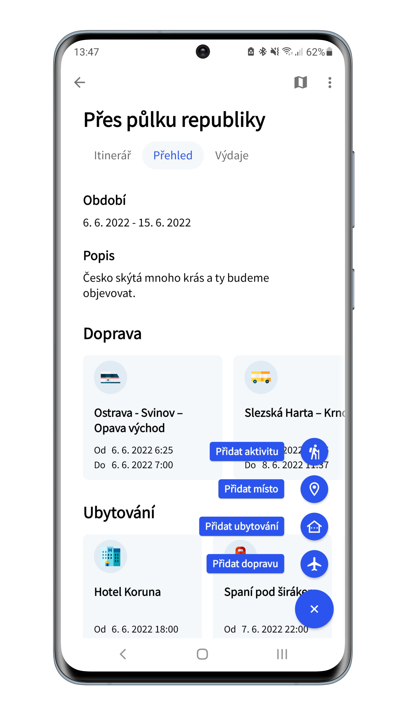
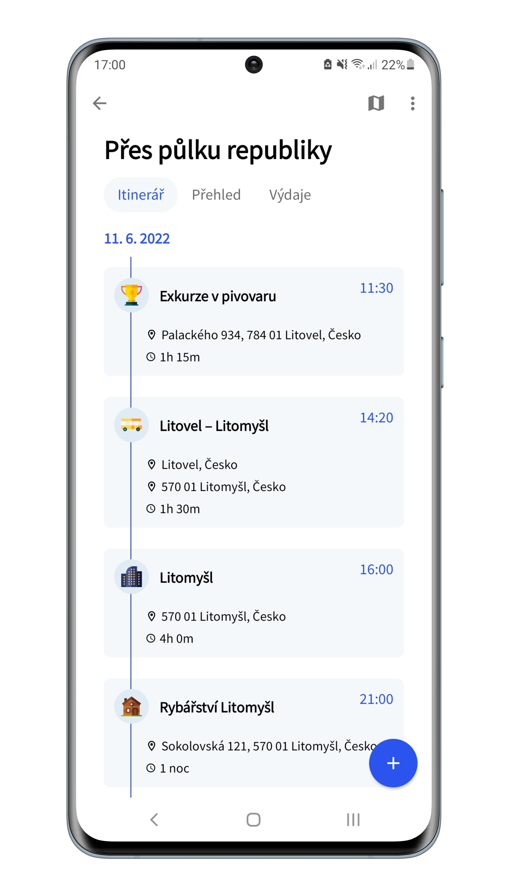
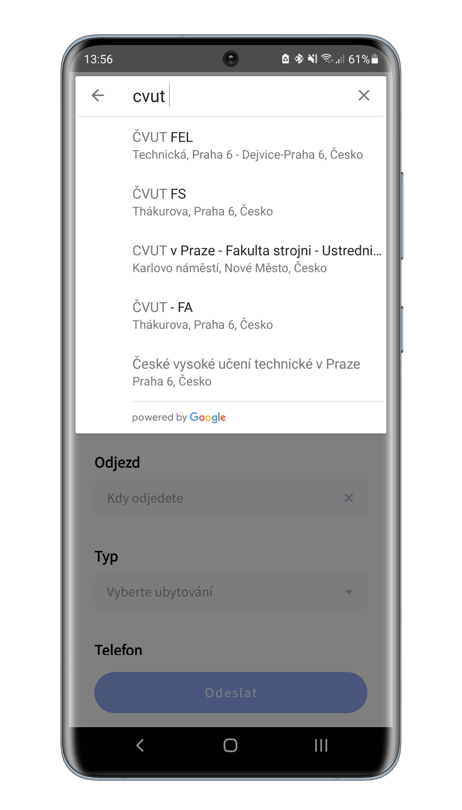
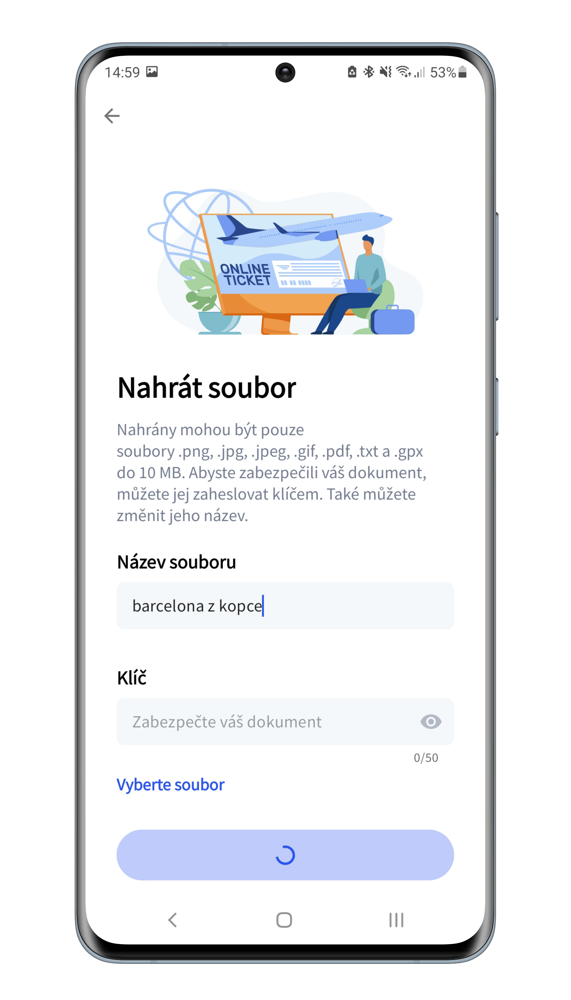
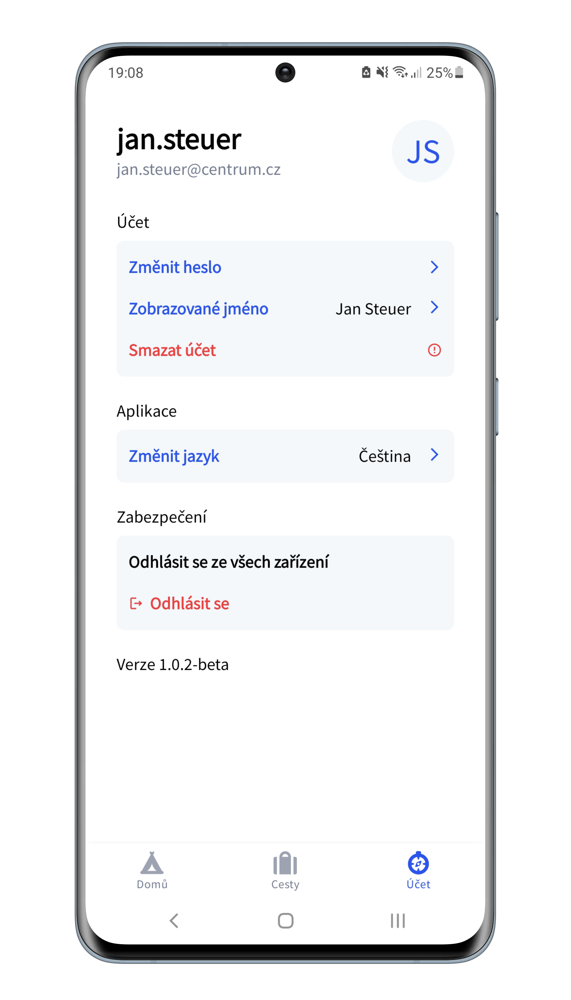

# Wanderscope

This diploma thesis deals with the development of a mobile application that provides users with an interface for group travel planning. The [web service](https://github.com/hawklike/Wanderscope-API) communicates with the mobile application using the REST architectural style and ensures the actual functionality of organizing and managing trips. In this work, the author describes step by step the various stages of development of both parts – the backend and the mobile application. The author also covers the design and implementation of user authentication accomplished by refreshing JWT tokens in this work. The output of this diploma thesis is a functional and user-tested mobile application that allows organizing trips in a group.

## About 💡
Wanderscope is a mobile app that allows organizing trips with other travelers. Wanderscope will create an itinerary according to your plans, help you with splitting group expenses and save your travel documents.

## Features 👓
*  Login with email and password, change password, and forgot password features
*  Authorization using rotating JWT tokens (access and refresh tokens)
*  Invite to trip other travellers with custom permissions
*  Upload and download files (encrypted and may be key-protected)
*  Create or join trips, add points of interests
*  Search places with Google autocomplete
*  Show places on Google Map

## Future 🔍
- [ ] Notifications
- [ ] Splitting group expenses
- [ ] History of changes
- [ ] Google authentication
- [ ] Share a trip with a link
- [ ] Offline access

## Build with 🛠️
Kotlin ● RecyclerView with ListAdapter ● ViewPager2 ● Jetpack Datastore ● Encrypted SharedPreferences ● Retrofit with Authenticator and Interceptors ● Koin for DI ● Jetpack DataBinding ● Jetpack Navigation Component ● MVVM ● LiveData, MediatorLiveData, Transformations ● Kotlin Coroutines ● Kotlin Flow ● Moshi ● Google Places SDK ● Google Maps SDK ● Firebase Crashlytics and Timber ● Material Design 2

## How to run ❓
Download the project and replace your own `MAPS_API_KEY` in `local.properties`. 

## Screenshots 🖼️

  
   
  

  
   
  

## Contributors 👷
Made by Jan Steuer  
Ilustrations by [@pch.vector](https://www.freepik.com/author/pch-vector)
